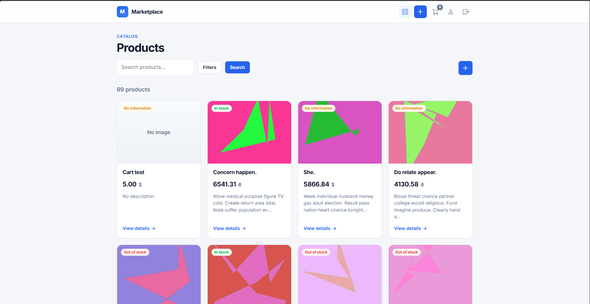
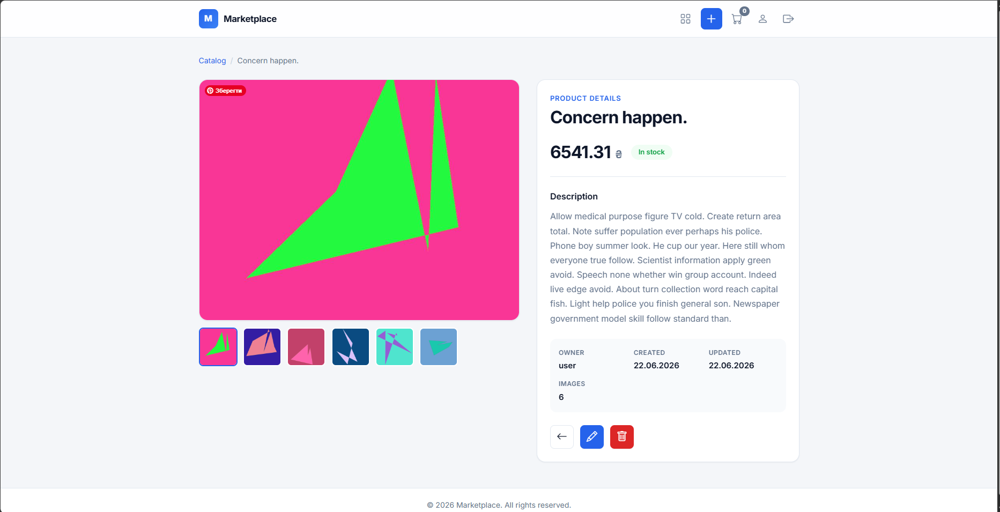
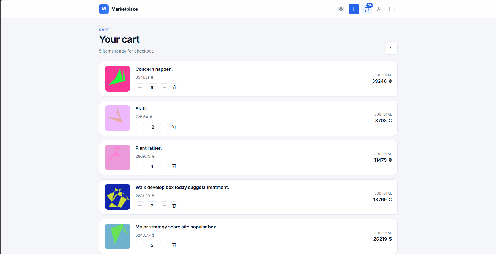
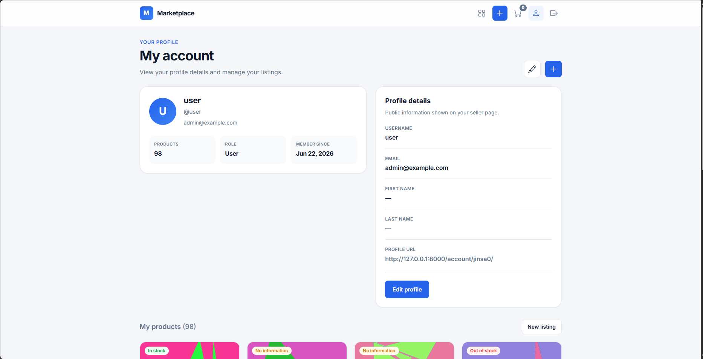
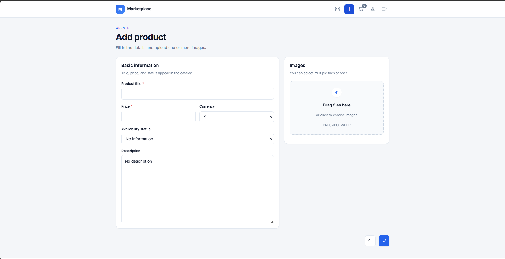
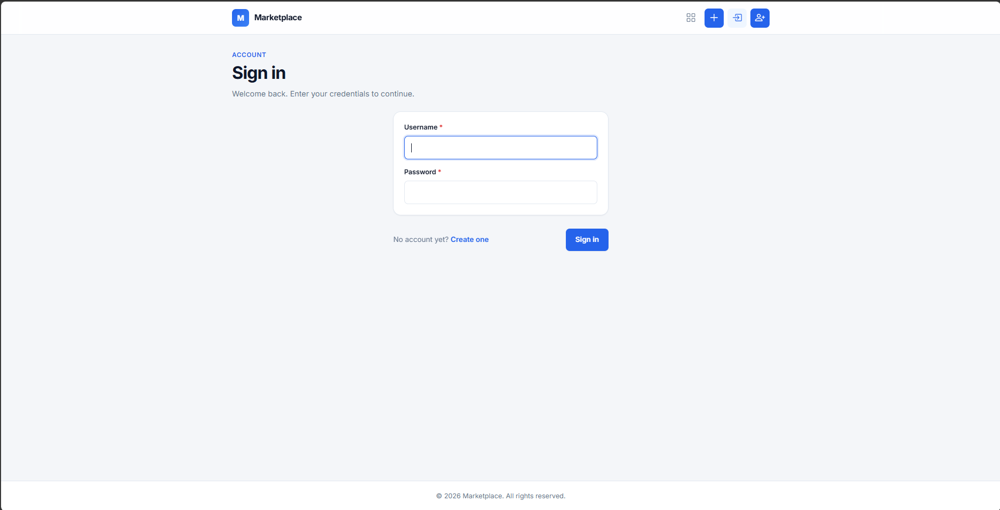

# Marketplace

> A full-featured Django marketplace platform for buying and selling products. Create your storefront, manage inventory, and connect with customers. Browse products, build your cart, and make purchases seamlessly.

## Description

Marketplace is a web application that enables users to:
- Create and manage product listings with multiple images
- Browse and search products by title, description, or seller
- Filter products by status and other criteria
- Manage shopping carts and view cart details
- Create user accounts and manage profiles
- View seller information and product details
- Track product status (In stock, Out of stock, No information)
- Support multiple currencies (Euro, Dollar, Hryvnia)

## Features

### Products
- Create, edit, and delete listings with up to 20 images
- Multiple currencies support (€, $, ₴)
- Track product status and inventory

### Shopping Cart
- Add/remove products with quantity tracking
- Per-user cart management

### User Accounts
- User registration and profiles
- Admin and regular user roles

### Search & Filtering
- Full-text search across products and sellers
- Filter by status and categories
- Pagination support

## Tech Stack

**Backend**
- Python
- Django (class-based views)
- Django Filters for product filtering
- autoslug for URL-friendly slugs

**Frontend**
- HTML, CSS, JavaScript
- Bootstrap 5

**Database**
- SQLite (development)

**Additional Libraries**
- Pillow (image processing)

## Project Structure

```
Marketplace/
├── account/                 # User management and authentication
├── product/                 # Product and cart management
├── Marketplace/             # Project settings and configuration
├── templates/               # HTML templates
├── static/                  # Static assets (CSS, JavaScript)
├── media/                   # Uploaded media files
├── docs/                    # Documentation and screenshots
│   └── screenshots/         # Application screenshots
├── manage.py               # Django management script
└── README.md               # This file
```

## Screenshots

| Home Page | Product Detail |
|-----------|----------------|
|  |  |

| Shopping Cart | User Profile |
|---------------|--------------|
|  |  |

| Create Product | Login |
|----------------|-------|
|  |  |

> Screenshots are stored in [`docs/screenshots/`](docs/screenshots/).

## Installation

### 1. Clone the repository
```bash
git clone https://github.com/Akrix0/marketplace.git
cd marketplace
```

### 2. Create and activate virtual environment
```bash
# Windows
python -m venv venv
venv\Scripts\activate

# macOS/Linux
python -m venv venv
source venv/bin/activate
```

### 3. Install dependencies
```bash
pip install -r requirements.txt
```

### 4. Apply migrations
```bash
python manage.py migrate
```

### 5. (Optional) Create superuser for admin access
```bash
python manage.py createsuperuser
```

### 6. Run development server
```bash
python manage.py runserver
```

After running the server, access the application at: http://127.0.0.1:8000/

## Usage

1. **Registration & Authentication**
   - Create a new account or log in with existing credentials
   - View and edit your profile

2. **Browse Products**
   - Explore the product feed on the home page
   - Search for products by title, description, or seller name
   - Filter products by status
   - View product details including images and seller information

3. **Manage Your Products**
   - Create new product listings (authenticated users only)
   - Upload up to 20 images per product
   - Set product price, currency, and status
   - Edit and update your product listings
   - Delete products you no longer want to sell

4. **Shopping Cart**
   - Add products to your shopping cart
   - View your cart with all items and total count
   - Manage cart quantities (coming soon)
   - Proceed to checkout (coming soon)

5. **User Profile**
   - View your profile with all your listed products
   - View other sellers' profiles
   - Check seller information on product details

## License

This project is licensed under the MIT License - see the [LICENSE](LICENSE) file for details.

## Credits

Developed by [Akrix0](https://github.com/Akrix0).